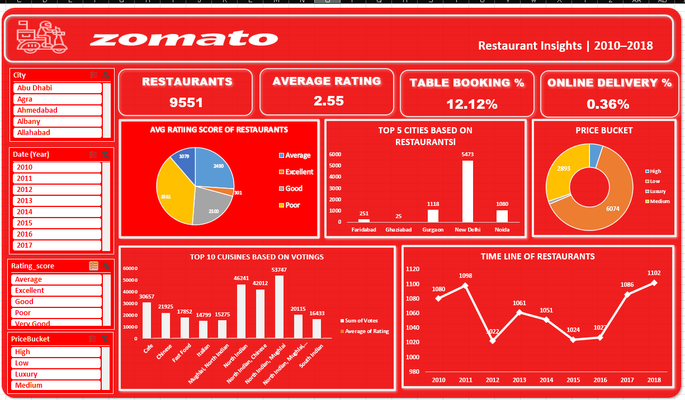
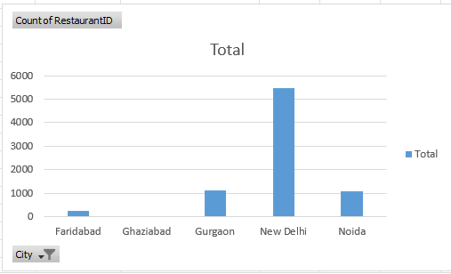
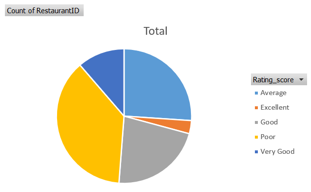
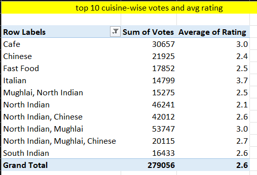
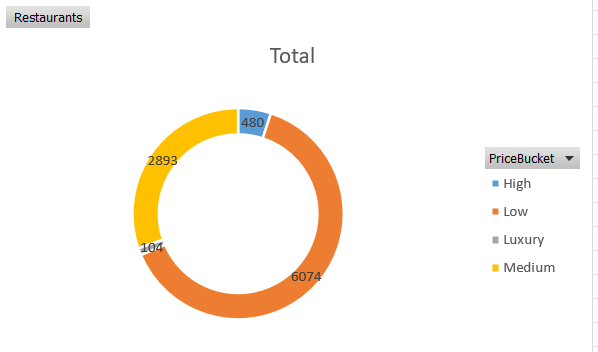

# 🍽️ Zomato Restaurant Analytics Dashboard (Microsoft Excel)

> An interactive Excel dashboard built using Microsoft Excel to analyze restaurant distribution, customer ratings, pricing, cuisines, and service availability, enabling data-driven business insights through dynamic KPIs and visualizations.

---

# Project Background

Zomato is one of the world's leading restaurant discovery and food services platforms. It enables users to discover restaurants, explore cuisines, compare prices, read customer reviews, and access services such as online food delivery and table booking.

From a data analyst's perspective, restaurant data provides valuable insights into customer preferences, market distribution, pricing strategies, and service adoption. This project focuses on transforming raw restaurant data into an interactive dashboard that supports business decision-making.

### Industry

Food Technology (FoodTech)

### Business Model

Online Restaurant Discovery & Food Delivery Platform

### Products & Services

- Restaurant Discovery
- Customer Reviews & Ratings
- Online Food Delivery
- Table Booking
- Restaurant Listings

### Key Business Metrics

- Total Restaurants
- Average Rating
- Online Delivery %
- Table Booking %
- Restaurant Distribution
- Cuisine Popularity
- Price Bucket Distribution

---

## Insights and Recommendations

Insights and recommendations are provided on the following key areas:

* **Restaurant Distribution**
* **Customer Ratings**
* **Cuisine Performance**
* **Restaurant Services & Pricing**

---

### Project Files

* **Excel Workbook:** `Zomato_Restaurant_Analytics.xlsx`
* **Dashboard:** `Images/Dashboard.png`
* **Dataset:** `Dataset.xlsx`

---

# Data Structure & Initial Checks

The project consists of **12 worksheets** with a total of **9,551 restaurant records**.

### Main

Contains the raw restaurant dataset including restaurant name, city, country, cuisines, ratings, votes, average cost, online delivery, table booking, and opening date.

### Country

Country lookup table used to map Country IDs to Country Names.

### Currency

Currency lookup table used for converting local restaurant prices into USD.

### Datekey

Calendar table created using the minimum and maximum opening dates with Year, Month, Quarter, Financial Month, and Financial Quarter.

### Country_Analysis

Restaurant distribution across different countries.

### Cuisine_Analysis

Analysis of cuisines based on total customer votes and average ratings.

### Price_Bucket

Classification of restaurants into pricing categories (Low, Medium, High, Luxury).

### Ratings

Distribution of restaurants across different rating categories.

### Table_Booking

Percentage analysis of restaurants offering table booking.

### Has_Online_Delivery

Percentage analysis of restaurants offering online delivery.

### Dashboard

Interactive Excel dashboard containing KPI Cards, Pivot Charts, and Slicers.

### Relationship Diagram / Data Model

---

# Executive Summary

## Overview of Findings

This project analyzes restaurant data to understand customer preferences, restaurant distribution, pricing segments, cuisine popularity, and service availability.

The dashboard reveals that restaurant distribution is highly concentrated in a few major cities, while customer ratings are primarily distributed between Average and Good categories. Popular cuisines receive significantly higher customer engagement through votes, making them strong candidates for promotional campaigns.

Additionally, the analysis shows that online delivery and table booking services are available in only a small percentage of restaurants, indicating potential opportunities for business expansion and service improvement.

---

### Dashboard Snapshot

---

# Insights Deep Dive

## Restaurant Distribution

### Main Insight 1

India has the highest number of restaurants within the dataset.

### Main Insight 2

New Delhi contains the largest concentration of restaurants.

### Main Insight 3

Restaurant distribution is heavily concentrated in a few metropolitan cities.

### Main Insight 4

Several countries have relatively small restaurant representation.

**Visualization**

---

## Customer Ratings

### Main Insight 1

Most restaurants fall into the Average and Good rating categories.

### Main Insight 2

Only a small percentage of restaurants are rated Excellent.

### Main Insight 3

The overall average restaurant rating is **2.55**.

### Main Insight 4

Customer ratings indicate opportunities for quality improvement.

**Visualization**

---

## Cuisine Performance

### Main Insight 1

North Indian cuisine receives the highest customer engagement based on votes.

### Main Insight 2

Cafe and Chinese cuisines also receive significant customer attention.

### Main Insight 3

Highly popular cuisines do not always achieve the highest average ratings.

### Main Insight 4

Regional cuisines show opportunities for targeted marketing.

**Visualization**

---

## Restaurant Services & Pricing

### Main Insight 1

Only **0.36%** of restaurants provide online delivery.

### Main Insight 2

Only **12.12%** of restaurants offer table booking.

### Main Insight 3

Most restaurants belong to Medium and High price categories.

### Main Insight 4

Pricing and service availability differ significantly across restaurant segments.

**Visualization**

---

# Recommendations

Based on the findings above, the **Business Strategy and Operations Team** should consider the following actions:

* Expand restaurant partnerships in cities with lower restaurant density.
* Increase the adoption of Online Delivery services.
* Encourage restaurants to enable Table Booking functionality.
* Promote highly rated restaurants through featured listings.
* Use customer voting trends to recommend popular cuisines and improve marketing campaigns.

---

# Assumptions & Caveats

Throughout the analysis, the following assumptions were made:

### Assumption 1

Customer ratings accurately represent restaurant quality.

### Assumption 2

Votes are considered a proxy for customer engagement and cuisine popularity.

### Assumption 3

Currency conversion rates supplied in the lookup table are assumed to be accurate.

### Assumption 4

The dataset is assumed to be complete and representative of the restaurants included in the analysis period.

---

# Tools Used

* Microsoft Excel
* Power Query
* Power Pivot
* Pivot Tables
* Pivot Charts
* Slicers
* GETPIVOTDATA
* XLOOKUP
* IF Functions
* Conditional Formatting
* Data Modeling

---

# Skills Demonstrated

* Data Cleaning
* Data Transformation
* Data Modeling
* Data Analysis
* Dashboard Design
* KPI Reporting
* Business Insights
* Data Visualization
* Excel Automation
* Interactive Reporting
